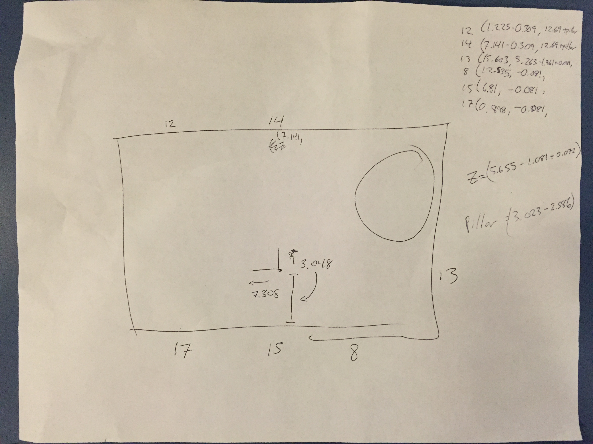

2015 HotWireless Paper
======================

This folder contains the data from the [2015 HotWireless paper](https://patpannuto.com/pubs/kempke15polypoint.pdf).

These experiments were run late at night in the predominantly empty atrium of
the Bob and Betty Beyster Building at the University of Michigan, Ann Arbor campus.



The Data
--------

There are three experiments in this dataset, two attempts at flying a
quadcopter (the second flight made the paper as it was a prettier looking
flight path), and stationary experiment that stood for roughly seconds at 25
points in a cross shape.

Each experiment contains both processed and raw data. The processed data is
easiest to work with, it is of the format:

    TIME\t\t\tPH X\tPH Y\tPH Z\tMO X\tMO Y\tMO Z\tERR

That is, a timestamp column, the PolyPoint X, Y, Z coordinate estimate, the
Optitrack motion capture ground truth X, Y, Z estimate, and the computed 3D
Euclidian distance between the two points.

### The Raw Data

Individual channel estimates were not collected in this dataset. The raw data
files are the aggregate estimate to each anchor (raw.log) and the computed
location estimate (log.txt).

The easiest way to grok the data processing is to skim over the `process.py` file.

For each of the flights, ground truth data is saved in the Optitrack folder.
The software periodically lost track of the marker it was tracking, labeling it
as a new marker. There is only one in practice and the processing scripts
simply consolidate this to a single column.

There is also a time offset between the start of each PolyPoint and Optitrack
trace.  The `process.py` file has these estimates as established by graphing
traces and visually aligning to find the offset.

---

```bibtex
@inproceedings{kempke15polypoint,
	title = {PolyPoint: Guiding Indoor Quadrotors with Ultra-Wideband Localization},
	booktitle = {2015 ACM Workshop on Hot Topics in Wireless},
	series = {HotWireless '15},
	year = {2015},
	month = {9},
	location = {Paris, France},
	conference-url = {http://web.cse.ohio-state.edu/~chebo/HotWireless/},
	extra = {Potential for Test of Time 2025 Award},
	author = {Kempke, Benjamin and Pannuto, Pat and Dutta, Prabal},
}
```
